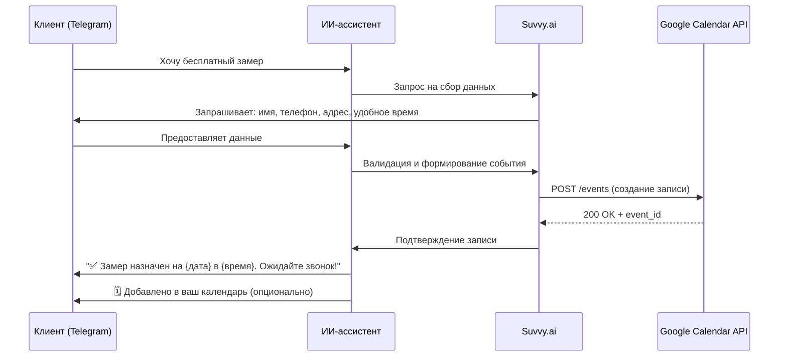

# 🪟 ИИ-ассистент для компании по установке окон

##Ссылка на проект:  
@Narjod_okna_bot 

## Скриншоты:
https://github.com/PAVIN7410/Narjod_okna_bot/blob/main/%D0%A1%D0%BD%D0%B8%D0%BC%D0%BE%D0%BA%20%D1%8D%D0%BA%D1%80%D0%B0%D0%BD%D0%B0%202026-03-11%20200228.png?raw=true


> Интеллектуальный чат-бот на базе нейросетей для автоматизации консультаций и записи клиентов оконного завода «Народные Окна»

[](https://telegram.org/)
[](https://qwenlm.github.io/)
[](https://suvvy.ai/)
[](LICENSE)

---

## 📋 Оглавление

- [О проекте](#-о-проекте)
- [Возможности](#-возможности)
- [Архитектура решения](#-архитектура-решения)
- [Используемые технологии](#-используемые-технологии)
- [Настройка и запуск](#-настройка-и-запуск)
- [База знаний](#-база-знаний)
- [Системный промпт](#-системный-промпт)
- [Интеграция с Google Календарём](#-интеграция-с-google-календарём)
- [Примеры диалогов](#-примеры-диалогов)
- [Мониторинг и аналитика](#-мониторинг-и-аналитика)
- [Безопасность данных](#-безопасность-данных)
- [Вклад в проект](#-вклад-в-проект)
- [Контакты](#-контакты)

---

## 🔍 О проекте

Этот проект представляет собой **умного ИИ-ассистента** для компании **«Народные Окна»** — завода по производству пластиковых и алюминиевых окон в Москве с опытом работы более 18 лет.

### 🎯 Цели проекта

| Цель | Описание |
|------|----------|
| 🤖 Автоматизация консультаций | Круглосуточные ответы на вопросы клиентов без участия оператора |
| 📅 Упрощение записи | Быстрая запись на бесплатный замер с синхронизацией в календарь |
| 🧠 Качество ответов | Осмысленные, контекстные ответы на основе актуальной базы знаний |
| 📈 Конверсия | Увеличение количества заявок за счёт мгновенной реакции и персонализации |

### 👥 Целевая аудитория

- Клиенты, выбирающие окна для квартиры, дома или коммерческого объекта
- Менеджеры компании, разгруженные от рутинных консультаций
- Маркетологи, отслеживающие эффективность коммуникации

---

## ✨ Возможности

### 🗣️ Диалоговый интерфейс
```
✅ Понимание естественного языка на русском
✅ Контекстная память в рамках диалога
✅ Корректная обработка уточняющих вопросов
✅ Вежливый, профессиональный стиль общения
```

### 📚 Работа с базой знаний
```
✅ Ответы на 100+ частых вопросов о продукции
✅ Актуальные цены, акции, условия доставки
✅ Информация о гарантиях, материалах, монтаже
✅ Автоматическое обновление при изменении данных
```

### 📅 Запись и календарь
```
✅ Сбор контактных данных и параметров замера
✅ Проверка доступных слотов в расписании
✅ Автоматическое создание события в Google Calendar
✅ Напоминание клиенту о предстоящей встрече
```

### 🔧 Технические преимущества
```
✅ Масштабируемая архитектура на базе Suvvy.ai
✅ Лёгкая интеграция с Telegram и другими мессенджерами
✅ Логирование диалогов для анализа и обучения
✅ Возможность A/B-тестирования сценариев
```

---

## 🏗️ Архитектура решения

```
┌─────────────────────────────────────────┐
│           Клиент (Telegram)             │
└─────────────────┬───────────────────────┘
                  │
                  ▼
┌─────────────────────────────────────────┐
│         Telegram Bot API                │
│  • Приём сообщений                      │
│  • Отправка ответов                     │
│  • Обработка кнопок и inline-запросов   │
└─────────────────┬───────────────────────┘
                  │
                  ▼
┌─────────────────────────────────────────┐
│         Платформа Suvvy.ai              │
│  • Оркестрация диалога                  │
│  • Вызов LLM (Qwen)                     │
│  • Управление состоянием сессии         │
│  • Function calling для календаря       │
└─────────────────┬───────────────────────┘
                  │
        ┌─────────┴─────────┐
        ▼                   ▼
┌───────────────┐ ┌─────────────────┐
│   Qwen LLM    │ │  Google Calendar│
│ • Генерация   │ │  API            │
│   ответов     │ │ • Создание      │
│ • RAG по базе │ │   событий       │
│   знаний      │ │ • Проверка      │
│               │ │   слотов        │
└───────────────┘ └─────────────────┘
```

---

## 🧰 Используемые технологии

| Сервис | Назначение | Ссылка |
|--------|-----------|--------|
| **Qwen** | Генерация ответов, создание системного промпта, обработка базы знаний | [qwenlm.github.io](https://qwenlm.github.io/) |
| **Suvvy.ai** | Платформа для создания и управления ИИ-ассистентом, function calling | [suvvy.ai](https://suvvy.ai/) |
| **Telegram Bot API** | Канал коммуникации с клиентами, интерфейс бота | [core.telegram.org/bots](https://core.telegram.org/bots) |
| **Google Calendar API** | Синхронизация записей на замер, управление расписанием | [developers.google.com/calendar](https://developers.google.com/calendar) |
| **Markdown / JSON** | Форматирование базы знаний и конфигурационных файлов | — |

### Дополнительные инструменты
- 📊 **Яндекс.Метрика / GA4** — аналитика взаимодействий
- 🔐 **OAuth 2.0** — безопасная авторизация в Google Calendar
- 🗄️ **JSON / CSV** — хранение и обновление базы знаний
- 📝 **Git** — версионирование промптов и конфигураций

---

## ⚙️ Настройка и запуск

### Предварительные требования
- Аккаунт в [Suvvy.ai](https://suvvy.ai/)
- Токен Telegram-бота (получить у [@BotFather](https://t.me/BotFather))
- Google Cloud проект с включённым Calendar API
- Доступ к API Qwen (через платформу или self-hosted)

### Шаг 1: Настройка бота в Telegram
```bash
# Создайте бота и получите токен
@BotFather → /newbot → Ваше название → @username_бота
```

### Шаг 2: Конфигурация в Suvvy.ai
1. Создайте нового ассистента в панели Suvvy
2. В разделе **System Prompt** вставьте промпт из [`prompts/system_prompt.md`](prompts/system_prompt.md)
3. В разделе **Knowledge Base** загрузите файлы:
   - `knowledge/company_info.json` — данные о компании
   - `knowledge/products.json` — каталог и цены
   - `knowledge/faq.json` — частые вопросы и ответы

### Шаг 3: Подключение Telegram
```yaml
# config/integrations.yaml
telegram:
  enabled: true
  token: "${TELEGRAM_BOT_TOKEN}"
  webhook_url: "https://your-domain.com/webhook"
```

### Шаг 4: Интеграция с Google Calendar
```yaml
# config/calendar.yaml
google_calendar:
  enabled: true
  credentials_file: "credentials/calendar_service_account.json"
  calendar_id: "primary"  # или ID корпоративного календаря
  timezone: "Europe/Moscow"
  event_template:
    summary: "Замер: {client_name} — {address}"
    description: "Клиент: {phone}\nОбъект: {object_type}\nКомментарий: {notes}"
    duration_minutes: 60
```

### Шаг 5: Запуск и тестирование
```bash
# Проверка здоровья ассистента
curl https://api.suvvy.ai/v1/assistants/{id}/health

# Тестовый диалог через Telegram
Откройте бота в Telegram и напишите: "Здравствуйте, хочу замер на балкон"
```

---

## 📚 База знаний

### Структура файлов

```
knowledge/
├── company_info.json      # О компании: опыт, гарантии, контакты
├── products.json          # Каталог: профили, цены, характеристики
├── faq.json               # 100+ вопросов и ответов для клиентов
├── objections.json        # Скрипты обработки возражений
└── templates.json         # Шаблоны ответов для типовых сценариев
```

### Пример: `knowledge/products.json`
```json
{
  "plastic_windows": {
    "name": "Пластиковые окна ПВХ",
    "profiles": [
      {
        "brand": "Veka",
        "price_from": 8150,
        "unit": "руб./м²",
        "chambers": 5,
        "features": ["шумоизоляция", "энергосбережение"]
      },
      {
        "brand": "Kaleva",
        "price_from": 8800,
        "unit": "руб./м²",
        "chambers": 6,
        "features": ["инновационный профиль", "долговечность"]
      }
    ]
  },
  "aluminum_windows": {
    "name": "Алюминиевые окна",
    "profiles": [
      {
        "brand": "Alutech",
        "price_from": 22600,
        "unit": "руб./м²",
        "features": ["панорамное остекление", "лёгкость конструкции"]
      }
    ]
  }
}
```

### Обновление базы знаний
1. Внесите изменения в соответствующий JSON-файл
2. Загрузите обновлённый файл в раздел **Knowledge Base** в Suvvy
3. Протестируйте ответы на тестовых запросах
4. Зафиксируйте версию в `CHANGELOG.md`

---

## 🧠 Системный промпт

### Расположение
Файл: [`prompts/system_prompt.md`](prompts/system_prompt.md)

### Ключевые блоки промпта

```markdown
# РОЛЬ
Ты — консультант оконного завода «Народные Окна»...

# ЦЕЛИ
1. Квалифицировать лид
2. Помочь с выбором продукции
3. Записать на бесплатный замер

# ПРАВИЛА
- Отвечай на русском языке
- Будь вежлив, краток, структурирован
- Не выдумывай информацию, не указанную в базе знаний
- После записи на замер вызови функцию: add_to_google_calendar(...)

# БАЗА ЗНАНИЙ
Используй предоставленные данные о компании, продукции и ценах...

# СКРИПТЫ
При возражении «дорого» → подчеркни собственное производство и гарантию...
```

### Версионирование промптов
```
prompts/
├── v26.03_system_prompt.md    # Текущая версия
├── v26.02_system_prompt.md    # Архив
└── CHANGELOG.md               # История изменений
```

---

## 📅 Интеграция с Google Календарём

### Сценарий записи на замер



### Функция `add_to_google_calendar`

```json
{
  "name": "add_to_google_calendar",
  "description": "Создаёт событие замера в корпоративном календаре",
  "parameters": {
    "type": "object",
    "properties": {
      "client_name": {"type": "string", "description": "Имя клиента"},
      "phone": {"type": "string", "description": "Контактный телефон"},
      "address": {"type": "string", "description": "Адрес объекта"},
      "object_type": {"type": "string", "enum": ["квартира", "дом", "балкон", "офис"]},
      "preferred_datetime": {"type": "string", "format": "date-time"},
      "notes": {"type": "string", "description": "Дополнительные пожелания"}
    },
    "required": ["client_name", "phone", "address", "preferred_datetime"]
  }
}
```

### Обработка ошибок
| Ошибка | Действие |
|--------|----------|
| ❌ Конфликт времени | Предложить ближайшие свободные слоты |
| ❌ Недоступность API | Сохранить заявку в очереди и уведомить менеджера |
| ❌ Неверные данные | Запросить уточнение у клиента |

---

## 💬 Примеры диалогов

### Сценарий 1: Консультация по цене
```
Клиент: Сколько стоит окно на балкон?
Бот: Для балкона мы предлагаем пластиковые окна от 4 660 руб./м² 
     или алюминиевые от 8 200 руб./м². Точная стоимость зависит 
     от размера и комплектации. Хотите, чтобы замерщик бесплатно 
     приехал и сделал расчёт? 📏
```

### Сценарий 2: Обработка возражения
```
Клиент: Дороговато, есть дешевле?
Бот: Понимаю! Наши цены на 15-20% ниже рынка благодаря 
     собственному производству — без посредников. 
     Плюс сейчас акция: мультифункциональный стеклопакет в подарок 🎁
     Хотите, рассчитаю точную стоимость под ваш объект?
```

### Сценарий 3: Запись на замер
```
Клиент: Да, хочу замер.
Бот: Отлично! Для записи мне нужны:
     • Ваше имя
     • Телефон
     • Адрес объекта
     • Удобное время (будни 09:00-20:00, вых. 10:00-18:00)
     
     Замер бесплатный и ни к чему не обязывает ✅
```

---

## 📊 Мониторинг и аналитика

### Ключевые метрики
| Метрика | Цель | Инструмент |
|---------|------|-----------|
| Конверсия в замер | ≥35% | Suvvy Analytics / GA4 |
| Среднее время диалога | 3-5 мин | Логи Suvvy |
| Удовлетворённость (NPS) | ≥8.0 | Опрос после диалога |
| Точность ответов | ≥95% | Ручная выборка + тесты |
| Успешность записи | ≥90% | Статусы Google Calendar |

### Логирование диалогов
```json
{
  "dialog_id": "dlg_20260315_abc123",
  "timestamp": "2026-03-15T14:30:00+03:00",
  "user_id": "tg_user_456789",
  "greeting_variant": "B",
  "messages_count": 12,
  "converted_to_measurement": true,
  "calendar_event_id": "evt_google_xyz789",
  "nps_score": 9,
  "tags": ["price_inquiry", "balcony", "successful_booking"]
}
```

### Экспорт данных
```bash
# Экспорт диалогов за период
python scripts/export_logs.py --from 2026-03-01 --to 2026-03-31 --format csv

# Генерация отчёта по конверсии
python scripts/generate_report.py --metric conversion --group-by greeting_variant
```

---

## 🔐 Безопасность данных

### Защита персональной информации
```
✅ Все данные клиентов шифруются при передаче (TLS 1.3)
✅ Хранение в соответствии с 152-ФЗ «О персональных данных»
✅ Доступ к базе знаний — только по авторизации
✅ Регулярное резервное копирование конфигураций
```

### Политики конфиденциальности
- Данные не передаются третьим лицам без согласия клиента
- Логи диалогов обезличиваются при аналитике
- Возможность удаления данных по запросу клиента

### Аутентификация и авторизация
```yaml
# config/security.yaml
auth:
  telegram:
    verify_webhook: true
    allowed_updates: ["message", "callback_query"]
  google:
    service_account: true
    scopes:
      - "https://www.googleapis.com/auth/calendar.events"
  api:
    rate_limit: "100/hour"
    ip_whitelist: ["${TRUSTED_IPS}"]
```

---

## 🤝 Вклад в проект

### Как предложить улучшения
1. Создайте форк репозитория
2. Внесите изменения в промпт, базу знаний или документацию
3. Протестируйте локально через Suvvy Sandbox
4. Откройте Pull Request с описанием изменений

### Правила обновления промпта
```markdown
## Чек-лист перед деплоем:
- [ ] Протестированы все сценарии диалога
- [ ] Проверена совместимость с текущей версией Suvvy
- [ ] Обновлена версия в заголовке промпта (v26.03 → v26.04)
- [ ] Добавлена запись в CHANGELOG.md
- [ ] Уведомлена команда о изменениях
```

---

## 📞 Контакты

| Роль | Контакт |
|------|---------|
| 🏢 Компания | [«Народные Окна»](https://n-okna.ru/) |
| 📧 Email | info@n-okna.ru |
| 📞 Телефон | +7 (495) 984-32-90 |
| 📍 Адрес | г. Москва, ул. Свободы, д. 48 |
| 🤖 Поддержка бота | @narodnye_okna_bot |

---

## 📜 Лицензия

Проект является частной разработкой для компании «Народные Окна».  
Копирование, распространение или использование кода без письменного разрешения запрещено.

```
© 2026 ООО «Компания НО». Все права защищены.
```

---

> ⭐ **Совет разработчику**: Регулярно тестируйте промпт на реальных диалогах и обновляйте базу знаний минимум раз в месяц — это повышает точность ответов на 20-30%.

```
🔄 Последнее обновление: Март 2026
📅 Следующий аудит: Апрель 2026
```
